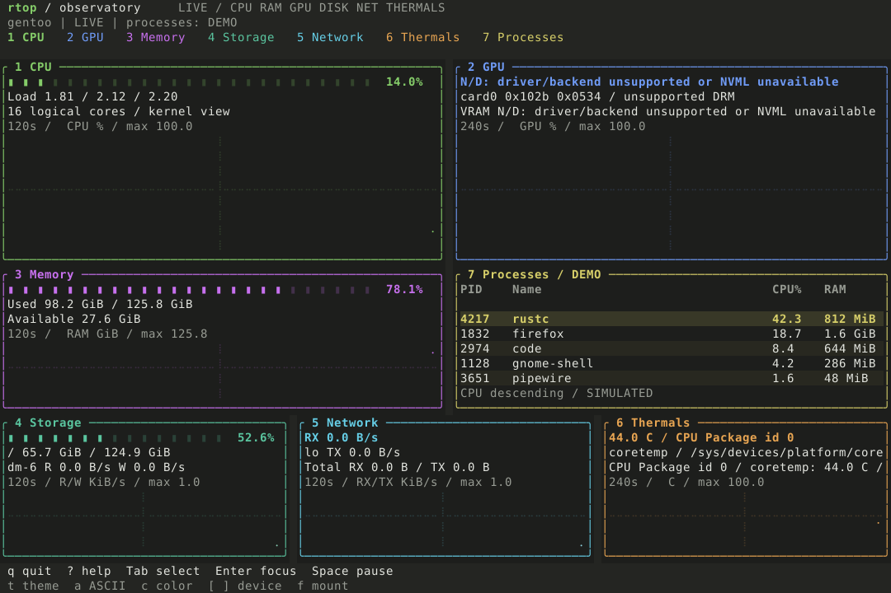

# rtop — observatory

Monitor Linux da terminale scritto in Rust e Ratatui. Una dashboard ispirata a top/htop, con tema antracite, grafici colorati e raccolta progettata per consumare poca CPU.

La dashboard mostra **CPU, RAM, rete e dischi reali**. GPU NVIDIA/AMD e temperature usano ora backend reali, con `N/D` per hardware assente o non supportato. Solo i processi restano simulati e indicati come `DEMO`, in attesa di M5. M3 integra worker, storico con timestamp e configurazione TOML.



## Stato e prestazioni

M1, M2 e M3 completate. M4 implementata e in validazione: i test senza GPU e le fixture NVIDIA/AMD passano, un utente ha confermato il riconoscimento di una NVIDIA T1000 su Debian. Restano il confronto delle metriche, i benchmark GPU e la verifica AMD reale. La raccolta dei processi è prevista in M5. Il pannello processi occupa metà della fascia centrale, accanto alla memoria.

| Misura su PTY, collector base a 1 Hz | M3: base | M4: base + sensori CPU |
| --- | --- | --- |
| Durata misurata | 1 ora | 1000 s |
| CPU media di un core | 0,33% | 0,408% |
| Memoria residente finale | 3,75 MiB | 4,25 MiB |
| Latenza input-render p95 | 5,57 ms | 4,97 ms |

Build release su pseudo-terminale 120×40 drenato, truecolor, nel sandbox Linux di riferimento. M4 include dieci sensori CPU a intervalli di 2 secondi e una GPU Matrox non supportata. Il costo dell'emulatore grafico, di GPU supportate reali e dei futuri collector processi è escluso. Metodo, hardware e dati grezzi: [verifica M3](docs/M3-VERIFICATION.md) e [verifica M4](docs/M4-VERIFICATION.md).

## Installazione

Richiede Linux, Git e una toolchain Rust compatibile con l'edizione 2024. Toolchain verificata: Rust 1.95.0.

```bash
git clone https://github.com/pascalbrax/rtop.git
cd rtop
cargo build --release --locked
./target/release/rtop
```

Per installare il comando nel percorso degli eseguibili Cargo:

```bash
cargo install --path . --locked
rtop
```

Non richiede privilegi root per le metriche attualmente implementate. Un terminale con supporto truecolor rende la palette completa; sono disponibili modalità ASCII e senza colore.

## Avvio

```bash
cargo run --release
cargo run --release -- --light
cargo run --release -- --ascii --no-color
cargo run --release -- --interval 2000
cargo run --release -- --demo
```

L'intervallo è espresso in millisecondi, da 100 a 60000. Default: 1000.

## Collector reali e benchmark (M2)

```bash
cargo build --release
./target/release/rtop --collect 3 --interval 1000
./target/release/rtop --benchmark --runs 3 --warmup 30 --duration 300 --interval 1000
```

`--collect` stampa CPU, RAM, rete, I/O e spazio filesystem in TSV. `--benchmark` misura i collector senza rendering e produce CSV; lo spazio filesystem viene aggiornato ogni 30 secondi. Il protocollo completo richiede circa 16 minuti e mezzo. Definizioni, confronti live, ambiente e risultati sono in [M2-VERIFICATION.md](docs/M2-VERIFICATION.md).

## Navigazione

| Tasto | Azione |
| --- | --- |
| Tab / frecce | Seleziona sezione |
| Shift-Tab | Seleziona sezione precedente |
| 1–7 | CPU, GPU, memoria, dischi, rete, temperature, processi |
| Enter | Alterna dashboard e vista dedicata |
| Esc | Torna alla dashboard / chiude aiuto |
| Spazio | Pausa/riprende raccolta e aggiornamenti |
| t | Tema chiaro/scuro |
| a | ASCII/Unicode |
| c | Attiva/disattiva colori |
| [ / ] | Cambia GPU, sensore, disco o interfaccia nel rispettivo pannello |
| f | Cambia filesystem nel pannello dischi |
| ? | Aiuto |
| q / Ctrl-C | Esce e ripristina il terminale |

Da 100×32 è visibile la dashboard completa. Nei terminali più piccoli viene mostrata la sezione selezionata. Dimensione minima: 60×18; sotto questa soglia appare un messaggio, con uscita sempre disponibile.

Il tema riprende il riferimento grafico fornito: sfondo antracite, superfici scure, colori luminosi, barre segmentate e grafici a linee con griglia tenue. La dashboard dispone CPU/GPU in alto, RAM e processi affiancati e dischi/rete/temperature nella fascia inferiore.

Ogni sezione ha un colore coerente su tab, titolo, bordo e grafico: CPU verde, GPU blu, RAM viola, dischi verde acqua, rete ciano, temperature ambra e processi giallo. Il tema chiaro usa varianti più scure per mantenere il contrasto; la selezione è indicata anche dalla sottolineatura. La modalità senza colore mantiene etichette e indicatore di selezione. L'effetto luminoso deriva dal contrasto statico: non ci sono animazioni o cicli di rendering aggiuntivi.

Le serie reali hanno timestamp monotoni, unità e scale esplicite; lo storico contiene 120 campioni per default. Errori, reset e lacune temporali interrompono le curve; alla ripresa dalla pausa le basi delle velocità vengono reinizializzate. Le serie demo conservano una scala normalizzata.

Il pannello processi mostra PID, nome, CPU% e RAM, con ordine CPU decrescente e righe alternate. Nella dashboard compaiono i primi processi che entrano nello spazio disponibile; con `7` e `Enter` si apre la vista dedicata. I valori dei processi sono simulati: la raccolta reale resta prevista in M5.

## Configurazione

Usare `--config PATH` oppure `$XDG_CONFIG_HOME/rtop/config.toml` / `~/.config/rtop/config.toml`. [Esempio TOML](config/example.toml). Gli argomenti CLI espliciti prevalgono sul file. `NO_COLOR` attiva la modalità senza colore; `--no-color=false` può forzare i colori.

```bash
cargo run --release -- --config config/example.toml
cargo run --release -- --theme light --history 120
```

## GPU e temperature

NVIDIA richiede la libreria runtime `libnvidia-ml.so.1` fornita dal driver. AMD usa le interfacce sysfs di `amdgpu`. I sensori CPU/GPU vengono letti da hwmon; le thermal zone sono un fallback identificato esplicitamente. L'assenza di una GPU supportata non impedisce l'avvio.

```bash
rtop doctor
rtop doctor --disable-nvml
rtop --hardware-interval 2000
rtop --benchmark-hardware --runs 3 --warmup 30 --duration 300
```

`doctor` spiega backend disponibili e metriche mancanti senza aprire la TUI. `hardware_interval` è configurabile anche nel TOML: default 2000 ms, limiti 1000–60000. Discovery ogni 30 secondi; nessun subprocess periodico. La raccolta hardware ha un worker separato, così una lettura driver lenta non blocca input o metriche di base. Dettagli e limiti: [M4-VERIFICATION.md](docs/M4-VERIFICATION.md).

## Anteprime riproducibili

```bash
cargo run -- --preview 80x24
cargo run -- --preview 120x40 --light
cargo run -- --preview 160x50
cargo run -- --preview 120x40 --svg --no-color=false > preview.svg
cargo run -- --preview 120x40 --live-preview --svg --no-color=false > live.svg
```

`--preview` usa il medesimo rendering della TUI attraverso `TestBackend`, senza richiedere un terminale interattivo. Le catture SVG conservano i colori delle celle; la resa dei glifi dipende dal font disponibile nel visualizzatore.

- [Dashboard live scura](docs/previews/live-dark-120x40.svg)
- [Dashboard live chiara](docs/previews/live-light-120x40.svg)
- [Prototipo scuro](docs/previews/dark-120x40.svg)
- [Tema chiaro](docs/previews/light-120x40.svg)
- [Compatta 80×24](docs/previews/80x24.txt)
- [Dashboard 120×40](docs/previews/120x40.txt)
- [Dashboard 160×50](docs/previews/160x50.txt)
- [ASCII senza colore](docs/previews/ascii-80x24.txt)

Le anteprime standard restano fixture deterministiche; `--live-preview` raccoglie due campioni reali prima della cattura. Solo i processi conservano fixture nella dashboard live; GPU e temperature mancanti mostrano `N/D`.

## Verifica

```bash
cargo fmt --check
cargo test
cargo clippy --all-targets -- -D warnings
cargo build
python3 tests/terminal_smoke.py
python3 tests/verify_collectors.py
python3 tests/config_cli.py
python3 tests/hardware_safety.py # richiede anche un compilatore C per la fixture NVML
python3 tests/tui_latency.py --output docs/benchmarks/m4-input-latency.json
python3 tests/tui_soak.py  # 1 ora misurata + 30 secondi iniziali
```

I test Rust coprono rendering alle dimensioni previste, temi, ASCII, navigazione, aiuto e terminali troppo piccoli. Lo smoke test Linux usa uno pseudo-terminale per verificare pause senza output periodico, resize, navigazione, uscita con q/Ctrl-C e ripristino delle impostazioni del terminale.

Il confronto live richiede Linux e gli strumenti `free`, `vmstat`, `ip` e `df`, eseguiti nello stesso namespace di rete del binario.

Il ciclo applicativo attende input o notifiche del worker, senza polling periodico della tastiera. Durante la pausa sospende la raccolta e attende input. Ratatui installa il panic hook di ripristino; una guardia ripristina il terminale anche quando il ciclo restituisce un errore.

## Piano

[Roadmap](ROADMAP.md) · [Milestone](MILESTONES.md) · [Evidenze M1](docs/M1-VERIFICATION.md) · [Evidenze M2](docs/M2-VERIFICATION.md) · [Evidenze M3](docs/M3-VERIFICATION.md) · [Evidenze M4](docs/M4-VERIFICATION.md)
